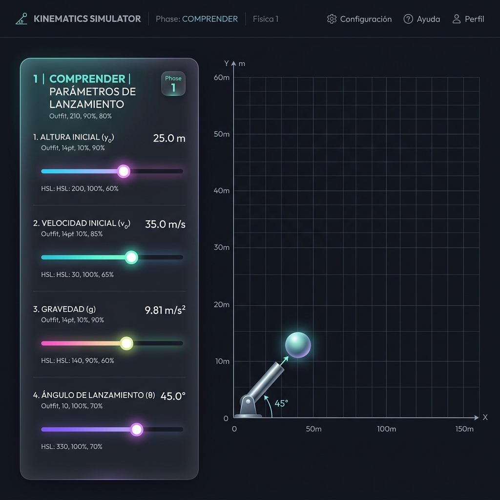
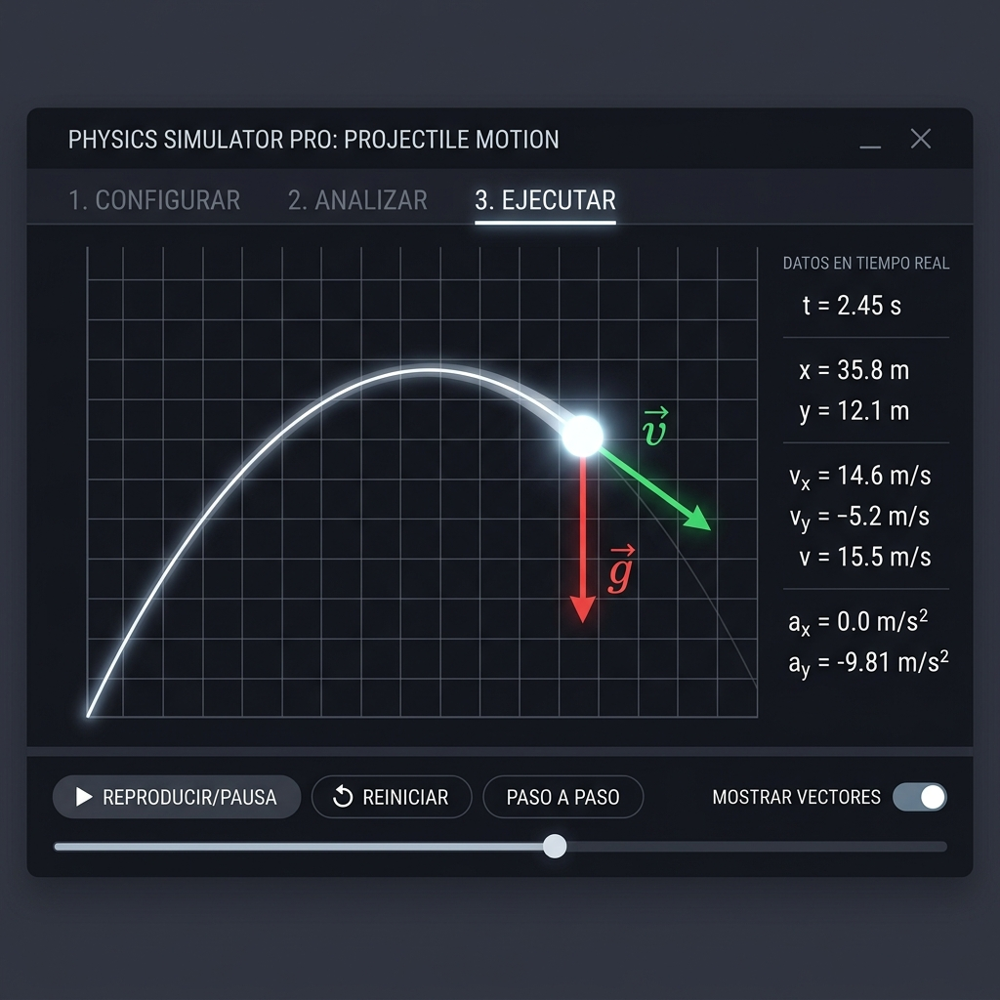
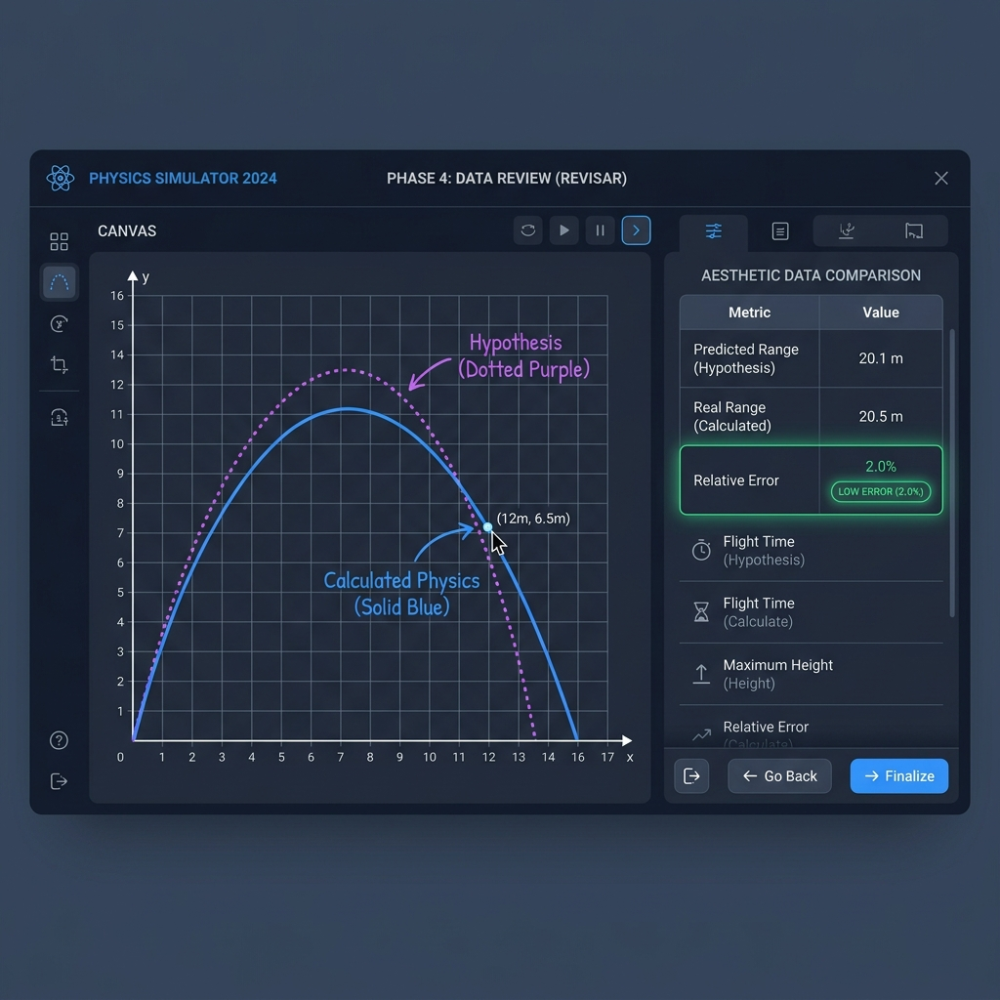

# Guía Didáctica del Estudiante — Cinemática en 2D (Tiro Parabólico y Caída Libre)

Bienvenido a tu secuencia de aprendizaje interactivo en el **Laboratorio de Física 1**. Esta guía de uso y fundamentación didáctica te acompañará a través de la simulación virtual de trayectorias físicas, apoyándote en la metodología de resolución de problemas de **George Pólya**, basada en la investigación del **Profesor Marcos Chacón Castro (UNAB, 2021)**.

El objetivo del laboratorio no es memorizar fórmulas, sino guiarte en la **experimentación científica activa** para que comprendas cómo las ecuaciones de la cinemática describen el comportamiento de proyectiles y partículas en caída libre dentro del mundo real.

---

## 1. Fundamento Físico del Fenómeno

La cinemática en dos dimensiones describe el movimiento de un objeto que se desplaza libremente en un plano vertical bajo la única influencia de la gravedad constante (despreciando la resistencia de la fricción del aire).

```
   y
   ▲       v₀  __.-'*' (Trayectoria Parabólica)
   │        _.-'      `'*.
   │      .'              '*.  ◄─── Partícula (x, y) con Vectores:
   │    .'                   '*.    - Velocidad (v) [Esmeralda, Tangente]
   │  .'                        '*. - Gravedad (g) [Rojo, hacia abajo]
   │ /                             '*
───┴─────────────────────────────────▲─────────────► x
  x₀=0                             Impacto (x_máx)
```

### El Movimiento Bidimensional Desacoplado:
Según el principio de independencia de Galileo Galilei, el movimiento de un proyectil es la combinación de dos movimientos independientes:

1.  **Eje Horizontal (Eje X):** Al no actuar ninguna fuerza horizontal, el cuerpo se desplaza a una **Velocidad Constante ($v_x$)**, correspondiente a un *Movimiento Rectilíneo Uniforme (MRU)*:
    $$x(t) = x_0 + v_{x0} \cdot t$$
    $$v_x(t) = v_{x0}$$

2.  **Eje Vertical (Eje Y):** Sobre el proyectil actúa una fuerza constante y dirigida hacia abajo: el campo gravitatorio de la Tierra. Por tanto, el cuerpo experimenta una **Aceleración Constante ($-g$)**, correspondiente a un *Movimiento Rectilíneo Uniformemente Variado (MRUV)*:
    $$y(t) = y_0 + v_{y0} \cdot t - \frac{1}{2}g \cdot t^2$$
    $$v_y(t) = v_{y0} - g \cdot t$$

### Descomposición de la Velocidad Inicial:
Cuando un objeto se lanza con una velocidad inicial $v_0$ y un ángulo $\theta$ respecto a la horizontal, dicha velocidad se divide en dos componentes vectoriales:
*   Componente horizontal: $v_{x0} = v_0 \cdot \cos(\theta)$
*   Componente vertical: $v_{y0} = v_0 \cdot \sin(\theta)$

---

## 2. Metodología de George Pólya y Marcos Chacón

Basado en las conclusiones de investigación didáctica en ingeniería del Profesor Marcos, estructuraremos tu estudio a través de **cuatro fases de aprendizaje heurístico** obligatorias para desarrollar tu razonamiento científico:

---

### Fase 1: Comprender el Problema (Variables del Sistema)

Antes de lanzar el proyectil, debes familiarizarte con las variables del entorno físico y sus restricciones matemáticas.



#### Instrucciones de Uso:
1.  Ajusta las condiciones iniciales del escenario utilizando los controles interactivos luminiscentes en el panel lateral:
    *   **Altura Inicial ($y_0$):** Establece la altura del cañón o plataforma en metros (de 0 a 30m).
    *   **Velocidad Inicial ($v_0$):** Asigna la velocidad con la que sale despedido el objeto en m/s.
    *   **Ángulo de Lanzamiento ($\theta$):** Regula la inclinación de salida (de 0 a 90 grados).
    *   **Gravedad ($g$):** Define la aceleración gravitatoria del campo local (puedes emular la gravedad terrestre a $9.81 \, m/s^2$ o experimentar en la gravedad lunar a $\approx 1.62 \, m/s^2$).
2.  **Cuestionario de Asimilación:** Lee con atención la pregunta conceptual de física sobre variables vectoriales y presiona la opción correcta. El Tutor Virtual evaluará tu razonamiento de forma inmediata y te proporcionará explicaciones pedagógicas. 
3.  Una vez comprendido el problema, la UI habilitará el botón **Proceder a Fase 2: Planear**.

---

### Fase 2: Concebir un Plan (Trazado de la Hipótesis)

Aquí formularás una predicción visual e intuitiva de cómo crees que transcurrirá la física del proyectil, estimando su geometría y punto de aterrizaje en base a los coeficientes configurados.

#### Instrucciones de Uso:
1.  **Dibujo de Trayectoria:** Haz clic izquierdo dentro del Canvas negro de simulación y, manteniendo el clic pulsado, **dibuja a mano alzada la curva elíptica/parabólica** que crees que describirá la trayectoria de la partícula. Se trazará una línea morada neón sutil.
2.  **Alcance Predicho:** Regula el control deslizante en el panel lateral para establecer en metros exactos dónde estimas que caerá el cuerpo contra el suelo. Esto dibujará una meta visual en forma de banderín ambar en el suelo métrico del simulador.
3.  Haz clic en **Proceder a Fase 3: Ejecutar** para validar tu hipótesis.

---

### Fase 3: Ejecutar el Plan (Simulación Activa y Análisis Vectorial)

Ejecuta el experimento físico en tiempo real a tasa constante de refresco, observando el rastro exacto y el comportamiento dinámico de los vectores de movimiento de la mecánica analítica.



#### Instrucciones de Uso:
1.  Presiona el botón **Iniciar Lanzamiento**.
2.  La simulación se animará a 60 FPS estables. Observa la telemetría dinámica en la esquina superior izquierda del simulador:
    *   **Vector Velocidad (Flecha Verde):** Es tangente a la curva en cada instante. Comprueba cómo su magnitud disminuye a medida que asciende el cuerpo (debido a la desaceleración del campo de gravedad vertical) y aumenta al descender. Su componente horizontal $v_x$ permanece permanentemente constante.
    *   **Vector Aceleración / Gravedad (Flecha Roja):** Permanece 100% invariable apuntando de forma perpendicular hacia abajo, demostrando visualmente que la gravedad actúa como un vector constante e independiente de la posición.
3.  Una vez que el proyectil aterrice en el suelo, la simulación se detendrá de forma segura. Presiona **Ver Resultados y Fase 4: Revisar**.

---

### Fase 4: Examinar la Solución (Contraste y Autoevaluación)

La fase de oro de George Pólya: mirar hacia atrás. Analizaremos tu estimación visual y matemática frente al comportamiento real medido por el motor y las ecuaciones clásicas exactas.



#### Instrucciones de Uso:
1.  El Canvas superpondrá automáticamente la curva de hipótesis dibujada por ti en morado frente al rastro real registrado en la simulación.
2.  Examina la **Tabla de Datos Comparativos**:
    *   **Alcance Máximo:** Contrasta tu predicción matemática en la bandera de meta con la distancia de impacto real del proyectil.
    *   **Cálculo de Error:** El sistema computa automáticamente el porcentaje de error relativo:
        $$\text{Error } \% = \left| \frac{\text{Alcance Real} - \text{Alcance Predicho}}{\text{Alcance Real}} \right| \times 100$$
3.  **Evaluación de Margen de Error (Badges):**
    *   `Low Error` (Verde, $\le 5\%$): ¡Excelente razonamiento físico y geométrico!
    *   `Medium Error` (Amarillo, $5\%$ a $15\%$): Desviación aceptable. Te aconsejamos ajustar el ángulo inicial o la velocidad para observar cómo afecta la parábola.
    *   `High Error` (Rojo, $> 15\%$): Desviación considerable. Indica que sobreestimaste la altura o asumiste una trayectoria rectilínea.
4.  Lee la **Retroalimentación Pedagógica del Tutor Polya** para comprender el porqué de la desviación y asimilar el concepto.
5.  Puedes presionar **Reiniciar Laboratorio** para volver a configurar la gravedad, probar lanzamientos sin gravedad o alturas máximas para seguir experimentando.
